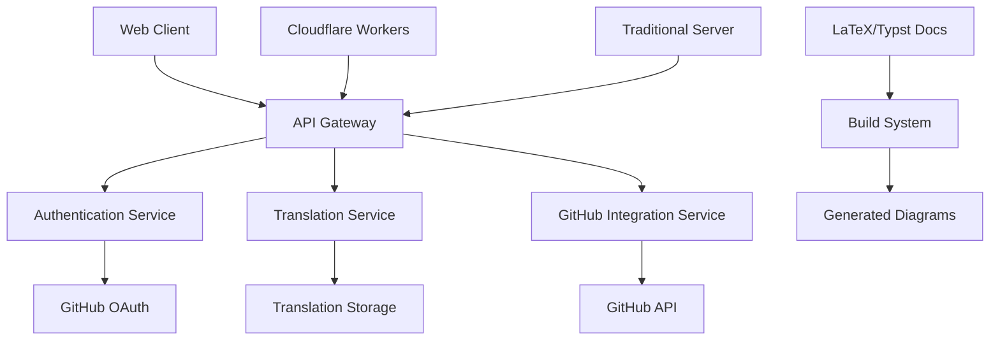

# I18n Platform Design Document

## Overview

The I18n Platform is a lightweight, Crowdin-like internationalization platform that enables collaborative translation management with seamless GitHub integration. The system prioritizes minimal infrastructure requirements, cross-platform compatibility, and an intuitive user experience while maintaining technical precision through mathematical documentation formats.

## Architecture

### Technology Stack Rationale

**Hono Framework Selection:**
- Ultra-lightweight with minimal overhead for 2GB RAM constraint compliance
- Native Cloudflare Workers support for serverless deployment option
- Node.js adapter for traditional server deployment flexibility
- Built-in middleware system for authentication, CORS, and rate limiting
- TypeScript-first design for type safety across the application
- Fast routing performance to meet 200ms response time requirements

**Solid.js Framework Selection:**
- Minimal bundle size to achieve 2-second load time requirement
- Fine-grained reactivity for efficient real-time validation feedback
- No virtual DOM overhead for optimal performance on mobile devices
- Reactive stores for state management across authentication and translation sessions
- Excellent TypeScript support for type-safe component development
- Small runtime footprint suitable for resource-constrained deployments

### High-Level Architecture



### Deployment Options

The platform supports two primary deployment architectures to meet minimal server requirements:

1. **Serverless (Cloudflare Workers)**
   - Hono's native Cloudflare Workers compatibility for edge computing
   - Automatic scaling and minimal operational overhead
   - Stateless request handling with external storage
   - Support for 100+ concurrent Translation_Sessions
   - 30-second startup time guarantee

2. **Traditional Server (Node.js)**
   - Hono's Node.js adapter for traditional server deployment
   - Single instance deployment with maximum 2GB RAM requirement
   - Container-based deployment for easy scaling
   - Local development and private cloud options
   - Stateless architecture to minimize resource consumption
   - Support for 100+ concurrent Translation_Sessions
   - 30-second startup time guarantee

## Configuration System

### Translation Configuration File

The platform uses a `.koro-i18n.repo.config.toml` configuration file in the repository root to define translation settings:

```toml
sourceLanguage = "en"
targetLanguages = ["es", "fr", "de", "ja"]
outputPattern = "src/locales/{lang}/{file}"
excludePatterns = ["**/node_modules/**", "**/dist/**"]
includePatterns = ["src/**/*.json", "src/**/*.md"]

[[sourceFiles]]
path = "src/locales/en.json"
format = "json"

[[sourceFiles]]
path = "src/components/messages.md"
format = "markdown"
keyPattern = "nested.key.path"

[settings]
submitAsPR = true
requireReview = true
autoMerge = false
prTitleTemplate = "feat(i18n): Update {language} translations"
commitMessageTemplate = "feat(i18n): Add {language} translation for {keys}"

[plugins]
# Plugin configuration for custom format handlers
enabled = ["json-plugin", "markdown-plugin"]
```

### File Discovery and Management

- Configuration-driven file discovery based on `.koro-i18n.repo.config.toml`
- Server reads configuration from repository's latest branch revision
- Pattern-based file inclusion/exclusion from configuration
- Dynamic output path generation based on language and source file
- No server-side configuration storage - always uses repository source of truth

## Plugin Architecture

### Format Plugin System

The platform implements a plugin architecture to support extensible input and output format handling:

**Plugin Interface:**
```typescript
interface FormatPlugin {
  name: string;
  version: string;
  supportedFormats: string[];
  parse(content: string): TranslationStrings;
  generate(strings: TranslationStrings): string;
  validate(content: string): ValidationResult;
}
```

**Built-in Format Plugins:**

**JSON Plugin:**
- Parses nested JSON objects for translation strings
- Generates JSON output maintaining original structure
- UTF-8 encoding with proper escaping
- Example: `{"ui": {"buttons": {"save": "Save", "cancel": "Cancel"}}}`

**Markdown Plugin:**
- Parses structured Markdown files with translation keys
- Generates Markdown output with consistent formatting
- Human-readable format for review and editing
- Example format:
  ```markdown
  # UI Translations
  
  ## Buttons
  - save: Save
  - cancel: Cancel
  ```

### Plugin Registration and Management

- Dynamic plugin loading at runtime
- Plugin compatibility validation during registration
- Graceful fallback when plugins fail to load
- Plugin configuration through TOML settings
- Error isolation to prevent plugin failures from affecting core functionality

## Components and Interfaces

### 1. Web Client (Frontend)

**Technology Stack:**
- Solid.js for reactive UI components with minimal bundle size
- CSS Grid/Flexbox for responsive design
- Progressive Web App (PWA) capabilities

**Key Components:**
- Authentication flow handler with GitHub OAuth integration using Solid.js reactive stores
- Translation editor interface with side-by-side source and target fields using Solid.js components
- Real-time validation feedback with character count and error messaging via reactive signals
- Mobile-optimized touch interactions for 320px+ screen widths with responsive Solid.js components
- Desktop-optimized keyboard and mouse interactions for up to 4K resolution
- Auto-save mechanism with 30-second intervals using Solid.js effects and timers
- Minimalist UI design requiring maximum 3 clicks for core features
- 2-second load time optimization leveraging Solid.js's small bundle size
- 200ms response time guarantee for user interactions with fine-grained reactivity

### 2. API Gateway

**Technology Stack:**
- Hono framework for lightweight, fast API development
- Compatible with both Cloudflare Workers and Node.js runtimes
- Built-in middleware support for authentication and CORS

**Responsibilities:**
- Request routing and rate limiting using Hono's middleware system
- CORS handling for cross-origin requests
- Request/response transformation with Hono's context system
- Authentication token validation through custom middleware

**Hono API Endpoints:**
```typescript
// Authentication routes
app.get('/api/auth/github', authController.initiateGitHubOAuth)
app.post('/api/auth/callback', authController.handleOAuthCallback)
app.post('/api/auth/logout', authMiddleware, authController.logout)

// Project management routes
app.get('/api/projects', authMiddleware, projectController.listProjects)
app.get('/api/projects/:id/strings', authMiddleware, projectController.getStrings)

// Translation routes
app.post('/api/translations', authMiddleware, translationController.submitTranslation)
app.get('/api/translations/status', authMiddleware, translationController.getStatus)
```

### 3. Authentication Service

**GitHub OAuth Integration:**
- OAuth 2.0 flow implementation with clear error messaging and retry options
- JWT token generation and validation
- Session management with minimum 24-hour expiry
- Secure credential storage with immediate session invalidation on logout
- GitHub identity integration for proper attribution

**Security Features:**
- CSRF protection for state-changing operations
- Rate limiting on authentication attempts
- Secure cookie handling with httpOnly flags
- Token refresh mechanism
- Authentication failure recovery with user-friendly error messages

### 4. Translation Service

**Core Functionality:**
- String parsing and validation with real-time feedback through format plugins
- Translation progress tracking with visual indicators
- Auto-save mechanism (30-second intervals) with draft persistence
- Conflict resolution for concurrent edits
- Source string display alongside translation input fields
- Interactive field highlighting when strings are selected
- Specific error messages with correction guidance for validation failures

**Plugin-Based Format Handling:**
- Dynamic format detection and plugin selection
- Plugin-based parsing for JSON and Markdown source files
- Plugin-based generation maintaining source format consistency
- Plugin validation with error isolation and fallback mechanisms

**Data Validation:**
- TOML format validation for configuration files with detailed error reporting
- Plugin-based format validation for source and target files
- Character encoding verification
- Placeholder consistency checking
- Length constraint validation
- Real-time character count display
- Format and content validation before submission

### 5. GitHub Integration Service (Translation_Bot)

**Bot Implementation:**
- Automated commit creation within 60 seconds of valid translation submission
- Co-author attribution system using GitHub identity of Translation_Contributor
- Direct commit to target repository with descriptive commit messages
- Retry mechanism for failed commits with user notification
- Branch management for translation workflows (optional PR mode)

**Commit Strategy:**
- Direct commits to target repository for immediate integration
- Descriptive commit messages indicating specific translation changes
- Co-author attribution in commit metadata
- Translation validation before commit creation
- Failure notification with retry options for Translation_Contributors
- Support for batch translations in single commit or individual commits per string

## Data Models

### User Model
```typescript
interface User {
  id: string;
  githubId: number;
  username: string;
  email: string;
  avatarUrl: string;
  accessToken: string; // encrypted
  refreshToken: string; // encrypted
  lastActive: Date;
  preferences: UserPreferences;
}

interface UserPreferences {
  language: string;
  theme: 'light' | 'dark' | 'auto';
  autoSave: boolean;
  notifications: boolean;
}
```

### Project Model
```typescript
interface Project {
  id: string;
  name: string;
  repository: {
    owner: string;
    name: string;
    branch: string;
  };
  sourceLanguage: string;
  targetLanguages: string[];
  translationFiles: TranslationFile[];
  settings: ProjectSettings;
  config: TranslationConfig;
}

interface ProjectSettings {
  submitAsPR: boolean;
  requireReview: boolean;
  autoMerge: boolean;
  commitMessageTemplate: string;
  prTitleTemplate: string;
  plugins: PluginConfig;
}

interface PluginConfig {
  enabled: string[];
  settings: Record<string, any>;
}

interface TranslationConfig {
  sourceFiles: SourceFileConfig[];
  outputPattern: string; // e.g., "locales/{lang}/{file}.json"
  excludePatterns: string[];
  includePatterns: string[];
}

interface SourceFileConfig {
  path: string;
  format: 'json' | 'markdown';
  keyPattern?: string; // for nested key extraction
  outputPath?: string; // override default output pattern
  plugin?: string; // specific plugin to use for this file
}

interface TranslationFile {
  id: string;
  sourcePath: string;
  outputPath: string;
  language: string;
  format: string;
  lastUpdated: Date;
  stringCount: number;
  translatedCount: number;
}
```

### Translation Model
```typescript
interface Translation {
  id: string;
  projectId: string;
  stringKey: string;
  sourceText: string;
  translatedText: string;
  language: string;
  status: 'draft' | 'submitted' | 'committed' | 'failed';
  contributor: {
    userId: string;
    username: string;
  };
  metadata: {
    createdAt: Date;
    updatedAt: Date;
    commitSha?: string;
    reviewStatus?: 'pending' | 'approved' | 'rejected';
  };
}
```

### Plugin Models
```typescript
interface FormatPlugin {
  name: string;
  version: string;
  supportedFormats: string[];
  parse(content: string): TranslationStrings;
  generate(strings: TranslationStrings): string;
  validate(content: string): ValidationResult;
}

interface TranslationStrings {
  [key: string]: string | TranslationStrings;
}

interface ValidationResult {
  isValid: boolean;
  errors: ValidationError[];
  warnings: ValidationWarning[];
}

interface ValidationError {
  message: string;
  line?: number;
  column?: number;
  key?: string;
}

interface ValidationWarning {
  message: string;
  line?: number;
  column?: number;
  key?: string;
}
```

## Performance and User Experience Requirements

### Response Time Guarantees
- User interface interactions must respond within 200 milliseconds
- Main interface loading within 2 seconds on standard internet connections
- Translation submission processing within 60 seconds
- System startup within 30 seconds of deployment

### Cross-Platform Compatibility
- **Mobile_Interface**: Touch-optimized interactions for mobile devices
- **Desktop_Interface**: Keyboard and mouse optimized for desktop devices
- Feature parity maintained between both interfaces
- Screen size support from 320px width to 4K resolution
- Progressive Web App capabilities for offline functionality

### User Interface Design Principles
- Minimalist design with essential functionality only
- Maximum 3 clicks required to access any core translation feature
- Clear visual hierarchy with readable typography and sufficient contrast
- Cognitive load minimization through grouped related functions
- Consistent interaction patterns across all interfaces

### Scalability Requirements
- Support for minimum 100 concurrent Translation_Sessions
- Stateless architecture for resource efficiency
- Maximum 2GB RAM requirement for traditional server deployment
- Horizontal scaling capability through serverless deployment option

## Error Handling

### Client-Side Error Handling
- Network connectivity detection
- Graceful degradation for offline scenarios
- User-friendly error messages with actionable guidance
- Automatic retry mechanisms with exponential backoff

### Server-Side Error Handling
- Structured error responses with error codes
- Logging and monitoring integration
- Circuit breaker pattern for external API calls
- Rollback mechanisms for failed commits

### GitHub API Error Handling
- Rate limit detection and queuing
- Authentication failure recovery
- Repository access validation
- Commit conflict resolution

## Testing Strategy

### Unit Testing
- Component-level testing for UI elements
- Service layer testing with mocked dependencies
- Utility function testing for validation logic
- Error handling scenario coverage

### Integration Testing
- GitHub OAuth flow end-to-end testing
- Translation submission and commit workflow
- Cross-browser compatibility testing
- Mobile device testing on various screen sizes

### Performance Testing
- Load testing for concurrent user scenarios
- Response time validation for UI interactions
- Memory usage monitoring for long sessions
- Network efficiency testing for mobile connections

## Security Considerations

### Authentication Security
- Secure token storage using httpOnly cookies
- CSRF token validation for state-changing operations
- OAuth state parameter validation
- Regular token rotation and expiry

### Data Protection
- Encryption at rest for sensitive user data
- TLS encryption for all client-server communication
- Input sanitization and validation
- SQL injection prevention (if using SQL database)

### GitHub Integration Security
- Minimal required permissions for GitHub access
- Secure webhook validation for repository events
- Rate limiting to prevent abuse
- Audit logging for all GitHub operations

## Documentation Architecture

### Mathematical Documentation System
- LaTeX or Typst format for system flow charts and architecture diagrams
- Mathematical format storage alongside source code in version control
- Automated updates to mathematical documentation when system architecture changes
- Version-controllable precision for technical context maintenance

### Build System Integration
- Documentation compilation as part of build process
- Visual diagram generation from mathematical format sources during build
- Syntax validation for mathematical formats during continuous integration
- Cross-reference validation between code and documentation
- Automated documentation deployment with releases
- CI/CD integration for mathematical documentation validation